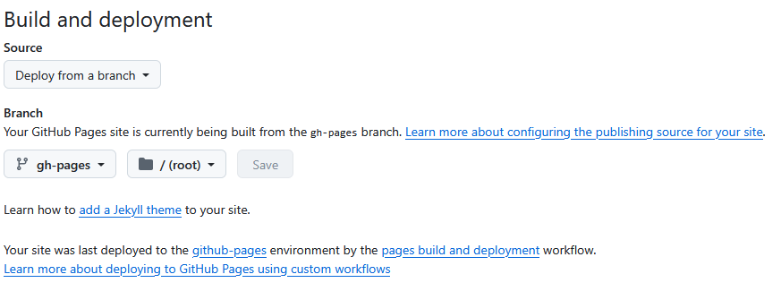

# Making tutorials for Geoscripting (GRS33806)

Tutorials made for the course geoscripting can be found at: https://geoscripting-wur.github.io/ 
They are stored and published through github: https://github.com/GeoScripting-WUR 
Tutorials are written in [quarto](https://quarto.org/), formerly R markdown files. 

## Publishing Quarto documents
Publishing documents can be done following [these steps](https://quarto.org/docs/publishing/github-pages.html#publish-command), using the `quarto publish gh-pages` command. This command requires a `_quarto.yml` file. For exampe, for the [PythonEnvs](https://github.com/GeoScripting-WUR/pythonEnvs/blob/main/_quarto.yml) tutorial this is: 

```
# _quarto.yml
project:
  type: website
  output-dir: _site

website:
  title: "Python Environments"
```

`quarto publish gh-pages` will create a new branch (`gh-pages`) in the github repository with all necessary files for creating the webpage. In github we need to configure pages so it reads from that branch, see settings > pages > build and deployment: 



